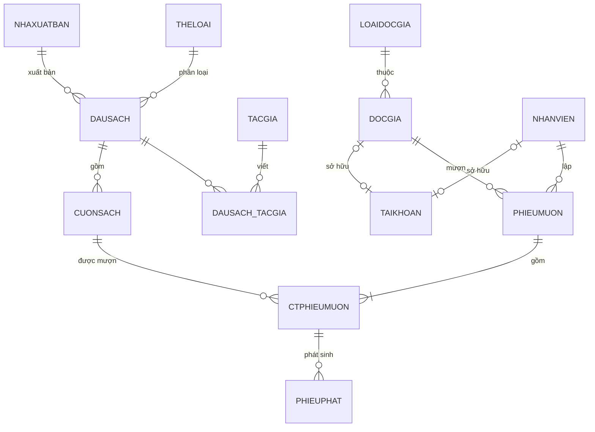

# QuanLyThuVien (Library Management System)

Đây là dự án ứng dụng web Quản lý Thư viện.

## Công nghệ sử dụng (Tech Stack)

- **Frontend:** React 19, TypeScript, Vite, Tailwind CSS 4, shadcn/ui
- **Backend:** ASP.NET Core Web API
- **Database:** Microsoft SQL Server
- **Orchestration:** .NET Aspire

## Cấu trúc dự án

- `frontend/`: Ứng dụng frontend sử dụng Vite + React.
- `QuanLyThuVien.Server/`: Backend API sử dụng ASP.NET Core.
- `QuanLyThuVien.AppHost/`: Dự án .NET Aspire AppHost để quản lý và điều phối các dịch vụ khi chạy ở môi trường phát triển (local).
- `docker-compose.mssql.yml`: File cấu hình Docker Compose để chạy cơ sở dữ liệu SQL Server ở local.

## Yêu cầu môi trường (Prerequisites)

Trước khi chạy dự án, hãy đảm bảo bạn đã cài đặt các công cụ sau:

- [.NET 10 SDK](https://dotnet.microsoft.com/download) (hoặc mới hơn) cùng với workload .NET Aspire
- [Node.js](https://nodejs.org/) (phiên bản 20.19.0 trở lên)
- [Docker Engine](https://docs.docker.com/engine/install/) (để chạy SQL Server)

## Hướng dẫn chạy dự án

### 1. Khởi động Database

Dự án sử dụng SQL Server. Bạn có thể sử dụng Docker Compose để khởi chạy một instance cục bộ nhanh chóng:

```bash
docker-compose -f docker-compose.mssql.yml up -d
```

_Lệnh này sẽ khởi chạy SQL Server ở địa chỉ `localhost:1444`._

### 2. Cài đặt các gói NPM (Frontend)

Mở terminal ở thư mục `frontend` và cài đặt các dependencies:

```bash
cd frontend
npm install
```

### 3. Chạy ứng dụng

Dự án này sử dụng **.NET Aspire** để quản lý đồng thời cả backend và frontend.

Tại thư mục gốc của dự án, chạy lệnh sau:

```bash
dotnet run --project QuanLyThuVien.AppHost
```

Lệnh này sẽ tự động thực hiện:

1. Khởi chạy backend ASP.NET Core.
2. Khởi chạy frontend Vite React.
3. Mở **.NET Aspire Dashboard** trên trình duyệt của bạn, tại đây bạn có thể xem log, các endpoint và quản lý các service đang chạy.

# CSDL Quản lý Thư viện (`QUANLYTHUVIEN`)

Script SQL Server cho đồ án IE103, chia file theo đúng các mục yêu cầu của đồ án.

## Thứ tự chạy

| #   | File                     | Nội dung                                                     | Số lượng                                         |
| --- | ------------------------ | ------------------------------------------------------------ | ------------------------------------------------ |
| 1   | `01_TaoBang.sql`         | Tạo CSDL, bảng, khóa chính, khóa ngoại, CHECK/DEFAULT/UNIQUE | 13 bảng                                          |
| 2   | `02_DuLieuMau.sql`       | Dữ liệu mẫu, mốc thời gian 26/09/2026                        | 10–31 dòng/bảng (riêng LOAIDOCGIA chỉ có 4 loại) |
| 3   | `03_Function.sql`        | Function                                                     | 3                                                |
| 4   | `04_Trigger.sql`         | Trigger (kèm bảng tầm ảnh hưởng)                             | 5                                                |
| 5   | `05_StoredProcedure.sql` | Stored Procedure: tham số vào; tham số vào + ra              | 6                                                |
| 6   | `06_Cursor.sql`          | Cursor (mỗi cursor gói trong 1 SP)                           | 2                                                |
| 7   | `07_AnToanThongTin.sql`  | Xác thực, phân quyền, Import/Export, Backup/Restore          | 3 role, 3 login                                  |
| 8   | `08_Report.sql`          | View làm nguồn cho report (Power BI / Tableau / web)         | 6                                                |

`02` phải chạy **trước** `04`, vì dữ liệu mẫu là lịch sử đã ở trạng thái cuối. `01` xóa và tạo lại CSDL, nên chạy lại từ `01` là reset toàn bộ.

Chạy bằng SSMS / Azure Data Studio (mở từng file rồi Execute), hoặc bằng `sqlcmd`:

```bash
# SQL Server trong docker-compose.mssql.yml (cổng 1444)
for f in database/0*.sql; do
  sqlcmd -S localhost,1444 -U sa -P 'Str0ngP4ssw0rd!' -C -f 65001 -b -i "$f" || break
done
```

Tài khoản đăng nhập mẫu của ứng dụng (bảng `TAIKHOAN`, mật khẩu `123456`): `admin` (quản lý), `ttkhoa` (thủ thư), `dg001` (độc giả), `dg009` (tài khoản bị khóa).

## Lược đồ quan hệ và tân từ

Khóa chính **in đậm**, khóa ngoại _in nghiêng_.

1. **THELOAI**(**MATL**, TENTL)
   Mỗi thể loại sách có một mã thể loại duy nhất và một tên thể loại không trùng.
2. **TACGIA**(**MATG**, TENTG, NAMSINH, QUOCTICH)
   Mỗi tác giả có mã duy nhất, họ tên, năm sinh (có thể không rõ) và quốc tịch.
3. **NHAXUATBAN**(**MANXB**, TENNXB, DIACHI, SODT)
   Mỗi nhà xuất bản có mã duy nhất, tên không trùng, địa chỉ và số điện thoại liên hệ.
4. **DAUSACH**(**MADS**, TENDS, _MATL_, _MANXB_, NAMXB, SOTRANG, GIA, SOLUONG, SLCON)
   Mỗi đầu sách (một tựa sách) có mã duy nhất, tên sách, thuộc một thể loại, do một NXB phát hành vào năm NAMXB, có số trang và giá bìa. SOLUONG là tổng số cuốn thư viện có, SLCON là số cuốn đang có sẵn để mượn (thuộc tính dẫn xuất).
5. **DAUSACH_TACGIA**(**_MADS_**, **_MATG_**, VAITRO)
   Tác giả MATG tham gia viết đầu sách MADS với vai trò tác giả chính, đồng tác giả hoặc dịch giả.
6. **CUONSACH**(**MACS**, _MADS_, NGAYNHAP, VITRI, TINHTRANG)
   Mỗi cuốn sách vật lý có mã riêng, thuộc một đầu sách, được nhập kho ngày NGAYNHAP, đặt tại vị trí VITRI, và đang ở một trong các tình trạng: Có sẵn, Đang mượn, Hư hỏng, Mất.
7. **LOAIDOCGIA**(**MALDG**, TENLDG, SOSACHTOIDA, SONGAYMUON)
   Mỗi loại độc giả (sinh viên, học viên cao học, giảng viên, khách ngoài) được mượn tối đa SOSACHTOIDA cuốn cùng lúc, mỗi lần mượn tối đa SONGAYMUON ngày.
8. **DOCGIA**(**MADG**, HOTEN, NGSINH, GIOITINH, DIACHI, SODT, EMAIL, _MALDG_, NGAYLAPTHE, NGAYHETHAN, TONGNO)
   Mỗi độc giả có mã thẻ duy nhất, thông tin cá nhân, thuộc một loại độc giả. Thẻ được lập ngày NGAYLAPTHE và hết hạn ngày NGAYHETHAN. TONGNO là tổng tiền phạt chưa thanh toán (thuộc tính dẫn xuất).
9. **NHANVIEN**(**MANV**, HOTEN, NGSINH, SODT, CHUCVU, NGVL)
   Mỗi nhân viên thư viện có mã duy nhất, họ tên, ngày sinh, số điện thoại, chức vụ và ngày vào làm.
10. **PHIEUMUON**(**MAPM**, _MADG_, _MANV_, NGAYMUON, HANTRA, TINHTRANG)
    Độc giả MADG mượn sách vào ngày NGAYMUON, do nhân viên MANV lập phiếu, phải trả trước ngày HANTRA. Phiếu ở tình trạng "Đang mượn" cho đến khi trả hết sách thì chuyển sang "Đã trả".
11. **CTPHIEUMUON**(**_MAPM_**, **_MACS_**, NGAYTRA, TINHTRANGTRA)
    Cuốn sách MACS được mượn theo phiếu MAPM. Khi trả thì ghi nhận ngày trả và tình trạng lúc trả (Bình thường, Hư hỏng, Mất). Chưa trả thì cả hai đều rỗng.
12. **PHIEUPHAT**(**MAPP**, _MAPM_, _MACS_, NGAYLAP, LYDO, SOTIEN, DATHANHTOAN)
    Phiếu phạt lập ngày NGAYLAP cho cuốn sách MACS thuộc phiếu mượn MAPM, vì lý do trả trễ, làm hư hỏng hoặc làm mất sách, với số tiền SOTIEN, đã hoặc chưa thanh toán.
13. **TAIKHOAN**(**TENDANGNHAP**, MATKHAU, MUOI, VAITRO, _MANV_, _MADG_, TRANGTHAI)
    Tài khoản đăng nhập ứng dụng, thuộc về một nhân viên (vai trò Quản lý / Thủ thư) hoặc một độc giả. Mật khẩu lưu dạng băm SHA2-256 kèm chuỗi muối. TRANGTHAI = 0 là tài khoản bị khóa.

Hai bảng kết quả của Cursor (tạo trong `06_Cursor.sql`): **DOCGIA_XEPLOAI**, **NHACNHO_QUAHAN**.

## Sơ đồ ERD



## Ràng buộc toàn vẹn

| #   | Ràng buộc                                                                               | Cài đặt                  |
| --- | --------------------------------------------------------------------------------------- | ------------------------ |
| R1  | Giá sách > 0, số trang > 0, năm XB từ 1900 đến năm hiện tại                             | CHECK                    |
| R2  | Tình trạng cuốn sách, tình trạng phiếu, lý do phạt thuộc miền giá trị cho trước         | CHECK                    |
| R3  | Ngày hết hạn thẻ > ngày lập thẻ; độc giả từ 16 tuổi; nhân viên từ 18 tuổi khi vào làm   | CHECK                    |
| R4  | Hạn trả > ngày mượn                                                                     | CHECK                    |
| R5  | Chi tiết phiếu mượn: đã trả thì phải có tình trạng trả, chưa trả thì không có           | CHECK                    |
| R6  | Tài khoản độc giả gắn với MADG, tài khoản nhân viên gắn với MANV                        | CHECK                    |
| R7  | SOLUONG, SLCON của đầu sách khớp với số cuốn / số cuốn có sẵn                           | `TRG_CUONSACH_CAPNHATSL` |
| R8  | Lập phiếu mượn: thẻ còn hạn, không nợ phạt, số ngày mượn ≤ quy định của loại độc giả    | `TRG_PHIEUMUON_KIEMTRA`  |
| R9  | Chỉ cho mượn cuốn "Có sẵn"; số sách đang mượn ≤ SOSACHTOIDA                             | `TRG_CTPM_MUONSACH`      |
| R10 | Trả sách: cập nhật tình trạng cuốn sách, tự lập phiếu phạt, đóng phiếu mượn khi trả hết | `TRG_CTPM_TRASACH`       |
| R11 | TONGNO của độc giả = tổng phạt chưa thanh toán                                          | `TRG_PHIEUPHAT_TONGNO`   |

Quy định phạt: trả trễ 5.000đ/ngày (`FN_TIENPHATTRE`), hư hỏng 50% giá sách, mất sách 100% giá sách.

## Dữ liệu mẫu bao phủ các trường hợp

- Độc giả thẻ hết hạn (DG006), đang nợ phạt (DG009, DG010, DG015), chưa từng mượn (DG012), không có email/địa chỉ (DG013, DG015).
- Phiếu trả đúng hạn, trả trễ, trả một phần, đang mượn, đang quá hạn (PM0011, PM0012).
- Sách bị làm hư (CS006, CS012), bị mất (CS015); đầu sách không có tác giả (DS016); thể loại chưa có sách (TL08, TL09); NXB thiếu địa chỉ (NXB10); tác giả không rõ năm sinh (TG010).
- Phiếu phạt đã và chưa thanh toán.
